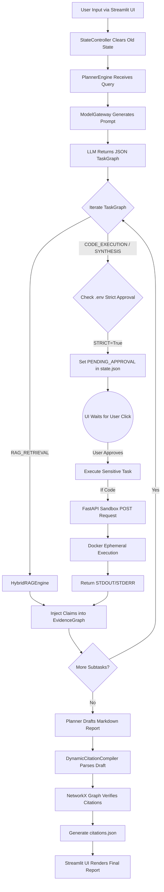

# High-End Workflow & Flowchart

This document illustrates the precise end-to-end operational flow of Aegis Research OS. The architecture operates entirely on a Zero-Trust, State-Driven Loop.

## Workflow Flowchart

## Step-by-Step Execution Sequence

1. **Initialization (`launcher.py`)**: A dual-process boot sequence starts both the Streamlit UI (Port 8501) and the FastAPI Sandbox Microservice (Port 8000).
2. **Cognitive Breakdown**: When a query is submitted, `src/orchestration/planner.py` uses `src/orchestration/gateway.py` to force an LLM (Gemini/Ollama) to strictly adhere to Pydantic schemas. This generates a `TaskGraph` composed of explicitly typed subtasks.
3. **Execution Routing**: The loop iterates through the tasks. Non-sensitive tasks execute immediately. Sensitive tasks trigger the HITL (Human-in-the-Loop) circuit breaker, halting the orchestrator until the UI sends an approval signal to `config/state.json`.
4. **Data Aggregation**: All task outputs (whether web scraping text, API code execution logs, or vectorized chunks) are fed blindly into the `EvidenceGraph`.
5. **Synthesis & Alignment**: The `PlannerEngine` requests the LLM to synthesize the aggregated evidence. The `DynamicCitationCompiler` then acts as the ultimate verifier, ensuring that every sentence in the final Markdown can trace its roots back to the `EvidenceGraph` via `[1]` citation tags.
