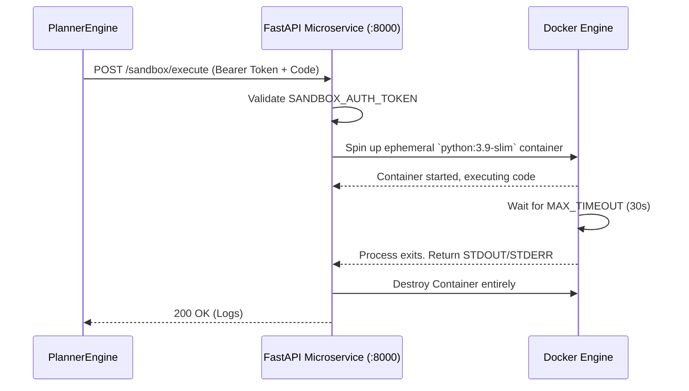

# Sandbox Execution Layer (Security & Air-Gapping)

The Sandbox Execution layer is the protective boundary of Aegis Research OS. Because the Orchestrator allows the LLM to write arbitrary Python scripts, executing those scripts natively poses a catastrophic security risk (host contamination, infinite loops, data exfiltration).

## Architectural Boundary

The system forces all dynamic execution to occur inside an isolated microservice.

## Core Components

### 1. The Sandbox Microservice (`src/security/api.py`)
- Built using FastAPI. 
- Serves as the middleman between the orchestrator and the Docker daemon.
- Requires static Bearer Token authentication (`SANDBOX_AUTH_TOKEN`) to prevent local unauthorized access if the UI is compromised.

### 2. The Docker Engine (`src/security/sandbox.py`)
- Reads the base image specified in `Dockerfile`.
- Uses the `docker` python SDK to spawn ephemeral containers.
- **Security Constraints**:
  - No host volumes are mounted (aside from strictly needed temp artifacts).
  - Memory bounds and CPU throttling prevent denial-of-service.
  - Strict 30-second execution timeouts. If a generated python script contains `while True: pass`, Docker abruptly kills the container and returns a `TimeoutError` log to the orchestrator.

### 3. Secure Browser Scraping (`src/security/browser_controller.py`)
- Housed within the Sandbox API, scraping is done via Headless Playwright using the `Dockerfile.browser` image. 
- This ensures that if the agent navigates to a malicious, javascript-heavy webpage, the exploitation is restricted entirely to the disposable browser container.
